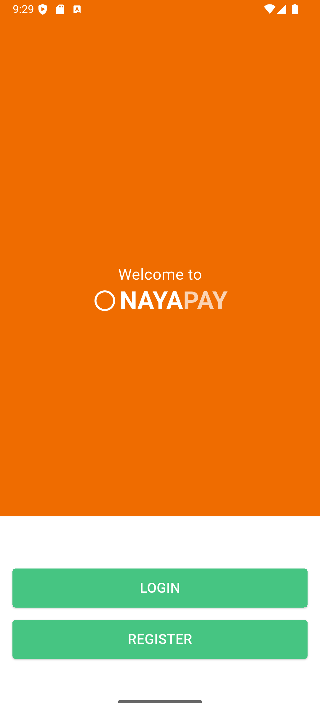
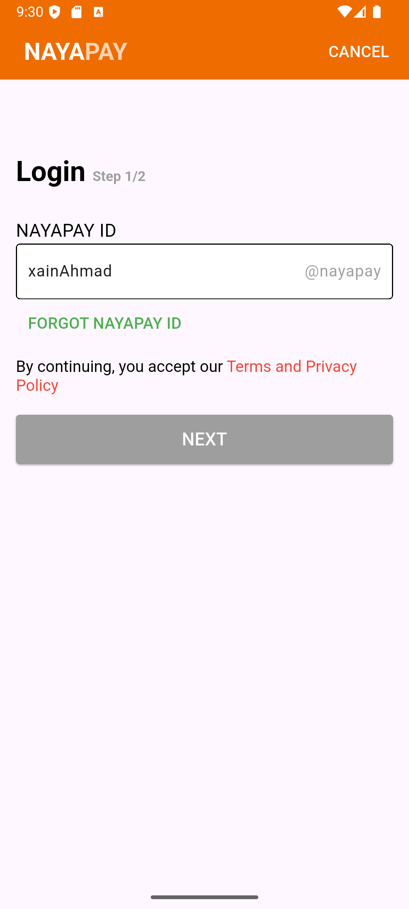

# NayaPay Login UI Design (Flutter)

A simple Flutter-based UI design of the NayaPay mobile app login and signup flow.  
This project was created purely as a **UI exercise** and is not connected to any backend or authentication service.

## Features 📱
- 🟠 NayaPay-themed splash-style home screen  
- 📩 Login flow with step-wise navigation  
- 🧾 Signup flow collecting basic user info  
- 📦 Clean UI using Flutter widgets  
- 🔁 Screen transitions using Navigator
- 📐 Simple layout with `TextField`, `RichText`, and `ElevatedButton`  

## Screenshots 📸
### **Home Page**

### **Login Page**

### **Signup Page**

## Tech Stack 🔧
- 🧱 **Flutter** (UI development)  
- 🎨 **Material Design 3**  
- 🧪 **Dart** (programming language)  

## Disclaimer 🚧
This is **not** an official NayaPay app. It was built solely for learning and showcasing Flutter UI capabilities.  
No data is collected or sent anywhere.